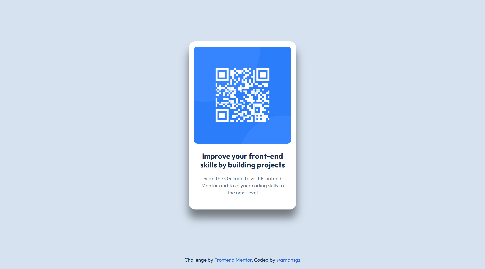
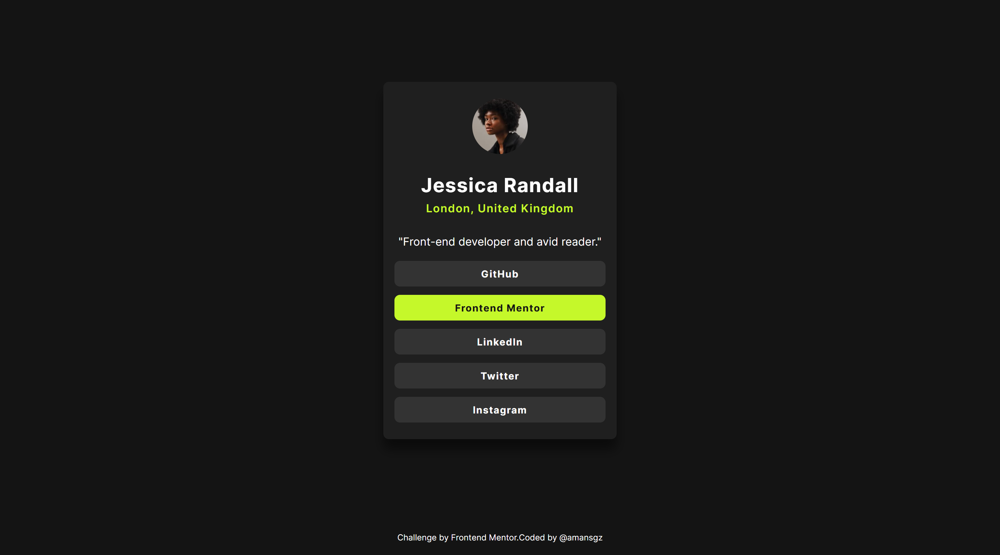

# Getting started on Frontend Mentor

A collection of my solutions for learning path [Getting started on Frontend Mentor](https://www.frontendmentor.io/learning-paths/getting-started-on-frontend-mentor-XJhRWRREZd).

## Table of contents

- [Learning goals](#learning-goals)
- [Solutions](#solutions)
  - [QR code component](#qr-code-component)
  - [Blog preview card](#blog-preview-card)
  - [Social links profile](#social-links-profile)
  - [Recipe page](#recipe-page)
- [How to run locally](#how-to-run-locally)
- [Author](#author)

## Learning Goals

- Master semantic HTML structure
- Improve CSS layout techniques (Flexbox)
- Build responsive components that work on all devices

## Solutions

### QR code component

[Code solution](https://github.com/amansgz/getting-started-on-frontend-mentor/tree/main/qr-code-component) | [Live site](https://amansgz.github.io/getting-started-on-frontend-mentor/qr-code-component/index.html)



### Blog preview card

[Code solution](https://github.com/amansgz/getting-started-on-frontend-mentor/tree/main/blog-preview-card) | [Live site](https://amansgz.github.io/getting-started-on-frontend-mentor/blog-preview-card/index.html)


### Social links profile

[Code solution](https://github.com/amansgz/getting-started-on-frontend-mentor/tree/main/social-links-profile) | [Live site](https://amansgz.github.io/getting-started-on-frontend-mentor/social-links-profile/index.html)



### Recipe page

[Code solution](https://github.com/amansgz/getting-started-on-frontend-mentor/tree/main/recipe-page) | [Live site](https://amansgz.github.io/getting-started-on-frontend-mentor/recipe-page/index.html)


## How to Run Locally

1. Clone this repository:

```bash
git clone https://github.com/amansgz/getting-started-on-frontend-mentor.git
```

2. Navigate to any project folder:

```bash
cd qr-code-component
```

3. Open `index.html`in your browser or use Live Server in VS Code.

## Author

- Frontend Mentor - [@amansgz](https://www.frontendmentor.io/profile/amansgz)
- Github - [@amansgz](https://github.com/amansgz)
