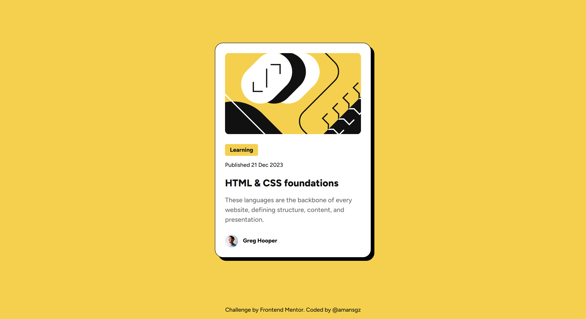

# Frontend Mentor | Blog Preview Card

This is a solution to the [Blog preview card challenge on Frontend Mentor](https://www.frontendmentor.io/challenges/blog-preview-card-ckPaj01IcS).

- [Overview](#overview)
  - [The challenge](#the-challenge)
  - [Screenshot](#screenshot)
  - [Links](#links)
- [My process](#my-process)
  - [Built with](#built-with)
  - [What I learned](#what-i-learned)
  - [Continued development](#continued-development)
  - [Useful resources](#useful-resources)
- [Author](#author)
- [Acknowledgments](#acknowledgments)

## Overview

### The challenge

Users should be able to:

- See hover and focus states for all interactive elements on the page

### Screenshot



### Links

- Solution URL: [https://www.frontendmentor.io/solutions/blog-preview-card-sDpAD9byf0](https://www.frontendmentor.io/solutions/blog-preview-card-sDpAD9byf0)

- Live Site URL: [https://amansgz.github.io/getting-started-on-frontend-mentor/blog-preview-card/index.html](https://amansgz.github.io/getting-started-on-frontend-mentor/blog-preview-card/index.html)

## My process

### Built with

- Semantic HTML5 markup
- CSS custom properties
- Flexbox
- Mobile-first workflow

### What I learned

- Adaptive image cropping: Using image container `height` and blog image `object=fit: cover` to show different image sections - a cropped portion on mobile vs. the complete image on desktop.

```css
.card-img-container {
  inline-size: 100%;
  block-size: 12.5rem;
}
.card-img {
  inline-size: 100%;
  block-size: 100%;
  object-fit: cover;
}
```

- How to apply stylish borders to the card using `border` and `box-shadow`

```css
.card {
  border: 1px solid var(--gray-950);
  box-shadow: 8px 8px 0px 0px #000000;
}
```

### Continued development

Moving forward, I want to solidify my HTML & CSS foundations by:

- Diving deeper into semantic HTML and accessibility attributes.
- Exploring advanced uses of CSS custom properties for theming and responsive design

### Useful resources

- [Getting started on Frontend Mentor](https://www.frontendmentor.io/learning-paths/getting-started-on-frontend-mentor-XJhRWRREZd) - This challenge is part of Frontend Mentor's learning path. It helps you start on the platform and gain experience working with designs and building small projects with HTML and CSS.

## Author

- Frontend Mentor - [@amansgz](https://www.frontendmentor.io/profile/amansgz)
- Github - [@amansgz](https://github.com/amansgz)

## Acknowledgments

- [Frontend Mentor](https://www.frontendmentor.io/) challenges help you improve your coding skills by building realistic projects.
