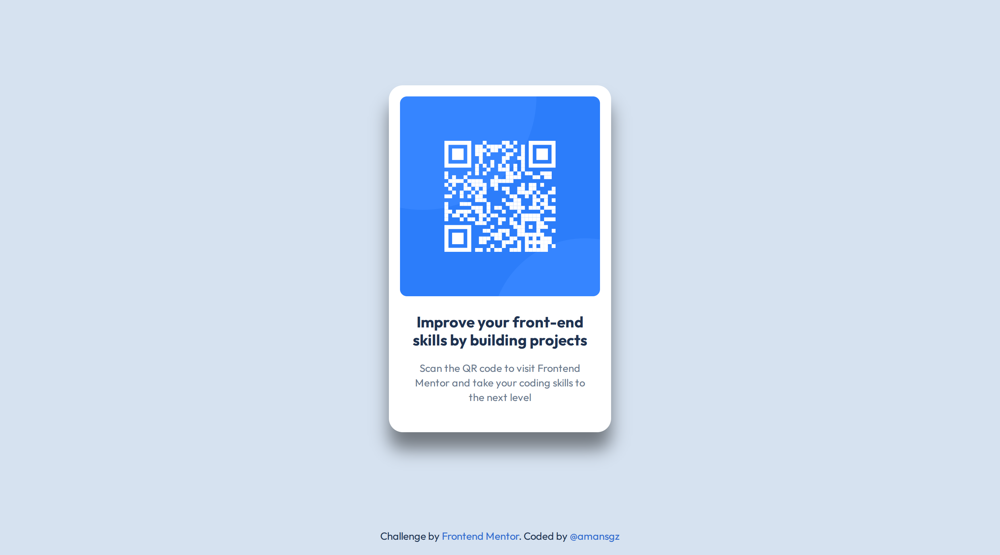

# Frontend Mentor - QR Code Component

A Frontend Mentor challenge solution implementing CSS custom properties for styling components.

## Table of contents

- [Overview](#overview)
  - [The challenge](#the-challenge)
  - [Screenshot](#screenshot)
  - [Links](#links)
- [My process](#my-process)
  - [Built with](#built-with)
  - [What I learned](#what-i-learned)
  - [Continued development](#continued-development)
  - [Useful resources](#useful-resources)
- [Author](#author)
- [Acknowledgments](#acknowledgments)

## Overview

### The challenge

The challenge was to build out this QR code component and get it as close as possible to the original design.

### Screenshot

### Links

- Live Site URL: [https://amansgz.github.io/getting-started-on-frontend-mentor/qr-code-component/index.html](https://amansgz.github.io/getting-started-on-frontend-mentor/qr-code-component/index.html)
- Solution URL: [https://www.frontendmentor.io/solutions/card-component-built-with-css-custom-properties-krZg583OIP](https://www.frontendmentor.io/solutions/card-component-built-with-css-custom-properties-krZg583OIP)
- Challenge URL: [https://www.frontendmentor.io/challenges/qr-code-component-iux_sIO_H](https://www.frontendmentor.io/challenges/qr-code-component-iux_sIO_H)

## My process

### Built with

- Semantic HTML5 markup
- CSS custom properties
- Flexbox
- Mobile-first workflow
- Figma design

### What I learned

**Semantic HTML**

- Used an `<article>` as our main card component

**Styling and Layout Approach**

- Implemented a design system based on the `Figma design` and style guide, using `CSS custom properties` for colors, font styles and elements spacing
- `Mobile-first` workflow

### Continued development

Moving forward, I want to solidify my HTML & CSS foundations by:

- Diving deeper into semantic HTML and accessibility attributes.
- Exploring advanced uses of CSS custom properties for theming and responsive design

### Useful resources

- [Getting started on Frontend Mentor](https://www.frontendmentor.io/learning-paths/getting-started-on-frontend-mentor-XJhRWRREZd) - This challenge is part of Frontend Mentor's learning path. It helps you start on the platform and gain experience working with designs and building small projects with HTML and CSS.

## Author

- Frontend Mentor - [@amansgz](https://www.frontendmentor.io/profile/amansgz)
- Github - [@amansgz](https://github.com/amansgz)

## Acknowledgments

- [Frontend Mentor](https://www.frontendmentor.io/) challenges help you improve your coding skills by building realistic projects.
