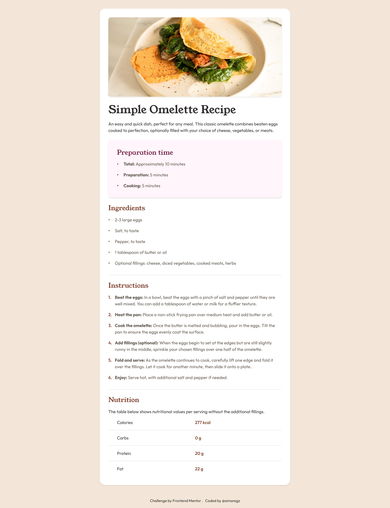

# Frontend Mentor - Recipe Page

This is a solution to the [Recipe page challenge on Frontend Mentor](https://www.frontendmentor.io/challenges/recipe-page-KiTsR8QQKm).

## Table of contents

- [Overview](#overview)
  - [The challenge](#the-challenge)
  - [Screenshot](#screenshot)
  - [Links](#links)
- [My process](#my-process)
  - [Built with](#built-with)
  - [What I learned](#what-i-learned)
  - [Continued development](#continued-development)
  - [Useful resources](#useful-resources)
- [Author](#author)
- [Acknowledgments](#acknowledgments)

## Overview

### The challenge

The goal was to build the optimal layout for the site depending on their device's screen size that closely matches the provided design.

### Screenshot



### Links

- Solution URL: []()

- Live Site URL: [https://amansgz.github.io/getting-started-on-frontend-mentor/recipe-page/index.html](https://amansgz.github.io/getting-started-on-frontend-mentor/recipe-page/index.html)

## My process

### Built with

- Semantic HTML5 markup
- BEM Methodology
- CSS custom properties
- Flexbox
- Mobile-first workflow

### What I learned

- Created custom bullets and counter list using pseudo-elements(`::before`)

```css
.recipe__list li::before {
  content: ".";
  position: absolute;
  inset-inline-start: 0;
  inset-block-start: -20px;
  font-size: 1.8rem;
}

.recipe__list--preparation li::before {
  color: var(--rose-800);
}

.recipe__list--ingredients li::before {
  color: var(--brown-800);
}
```

```css
.recipe__list--instructions li::before {
  content: counter(orderedList) ".";
  position: absolute;
  inset-inline-start: 0;
  inset-block-start: 0;
  font-size: 1rem;
  font-weight: var(--fw-semibold);
  color: var(--brown-800);
}
```

### Continued development

Moving forward, I want to solidify my HTML & CSS foundations by:

- Diving deeper into semantic HTML and accessibility attributes.
- Exploring advanced uses of CSS custom properties for theming and responsive design

### Useful resources

- [Getting started on Frontend Mentor](https://www.frontendmentor.io/learning-paths/getting-started-on-frontend-mentor-XJhRWRREZd) - This challenge is part of Frontend Mentor's learning path. It helps you start on the platform and gain experience working with designs and building small projects with HTML and CSS.

## Author

- Frontend Mentor - [@amansgz](https://www.frontendmentor.io/profile/amansgz)
- Github - [@amansgz](https://github.com/amansgz)

## Acknowledgments

- [Frontend Mentor](https://www.frontendmentor.io/) challenges help you improve your coding skills by building realistic projects.
