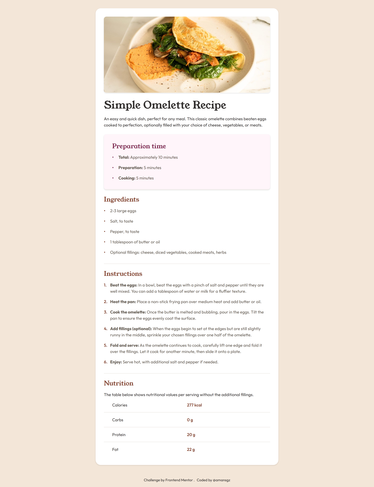

# Frontend Mentor - Recipe Page solution

This is a solution to the [Recipe page challenge on Frontend Mentor](https://www.frontendmentor.io/challenges/recipe-page-KiTsR8QQKm) , part of learning path [Getting started on Frontend Mentor](https://www.frontendmentor.io/learning-paths/getting-started-on-frontend-mentor-XJhRWRREZd).

## Table of contents

- [Overview](#overview)
  - [Learning goals](#learning-goals)
  - [The challenge](#the-challenge)
  - [Screenshot](#screenshot)
  - [Links](#links)
- [My process](#my-process)
  - [Built with](#built-with)
  - [Project Structure](#project-structure)
  - [Front-end style guide](#front-end-style-guide)
    - [Colors](#colors)
    - [Font](#font)
    - [Layout](#layout)
  - [What I learned](#what-i-learned)
    - [Semantic HTML Structure](#semantic-html-structure)
    - [CSS structure](#css-structure)
    - [CSS styles](#css-styles)
- [Author](#author)

## Overview

### Learning Goals

- Master semantic HTML structure
- Improve CSS layout techniques (Flexbox)
- Build responsive components that work on all devices

### The challenge

The goal was to build the optimal layout for the site depending on their device's screen size that closely matches the provided design.

### Screenshot



### Links

- Solution URL: [https://www.frontendmentor.io/solutions/responsive-recipe-page-with-css-custom-lists-and-table-b3PkL8p9hG](https://www.frontendmentor.io/solutions/responsive-recipe-page-with-css-custom-lists-and-table-b3PkL8p9hG)

- Live Site URL: [https://amansgz.github.io/getting-started-on-frontend-mentor/recipe-page/index.html](https://amansgz.github.io/getting-started-on-frontend-mentor/recipe-page/index.html)

## My process

### Built with

- Semantic HTML5 markup
- BEM Methodology
- CSS custom properties
- Flexbox
- Mobile-first workflow

### Project Structure

```
recipe-page/
|
|--- README.md
|--- index.html
|--- css/
|    |--- base.css
|    |--- main.css
|    |--- tokens.css
|    |--- layout.css
|    |--- components/
|         |--- recipe.css
|         |--- recipe-list.css
|         |--- recipe-table.css
|         |--- footer.css
|--- assets/
|    |---fonts/
|    |---images/
|--- screenshots/ (screenshots for mobile, tablet and desktop screens)
```

### Front-end Style Guide

#### Colors

```
- White: hsl(0, 0%, 100%)

- Stone 100: hsl(30, 54%, 90%)
- Stone 150: hsl(30, 18%, 87%)
- Stone 600: hsl(30, 10%, 34%)
- Stone 900: hsl(24, 5%, 18%)

- Brown 800: hsl(14, 45%, 36%)

- Rose 800: hsl(332, 51%, 32%)
- Rose 50: hsl(330, 100%, 98%)

```

#### Font

- Font size (paragraph): 16px
- Family: `Young Serif`
- Weights: `400` (regular)

- Family: `Outfit`
- Weights: `400`,`600`, `700` (regular, semibold, bold)

#### Layout

- **Mobile**: 320px - 768px
- **Tablet/Desktop**: 768px - 1440px
- **Desktop XL**: 1440px+

### What I learned

#### Semantic HTML Structure

The `<section>` groups related content (preparation, ingredients, instructions, nutrition).

The section `<header>` contains introductory content (recipe img, title and description).

```html
<!-- Recipe -->
<section>
  <!-- Recipe Header -->
  <header>
    <!-- img, title, description -->
  </header>

  <!-- Recipe Details -->
  <div>
    <!-- Preparation -->
    <section>
      <!-- title, list -->
    </section>

    <!-- Ingredients -->
    <section>
      <!-- title, list -->
    </section>

    <!-- Instructions -->
    <section>
      <!-- title, list -->
    </section>

    <!-- Nutrition -->
    <section>
      <!-- title, description, table -->
    </section>
  </div>
</section>
```

#### CSS Structure

- Main stylesheet path in `index.html`

```html
<link rel="stylesheet" href="./css/main.css" />
```

`main.css` import stylesheets:

```css
/* 1. TOKENS - Variables */
@import "tokens.css";

/* 2. BASE - Global styles, reset, typography */
@import "base.css";

/* 3. LAYOUT - Page structure*/
@import "layout.css";

/* 4. COMPONENTS */
@import "components/recipe.css"; /* imports list and table */
@import "components/footer.css";
```

#### CSS styles

Implemented a design system based on the style guide, featuring:

- **CSS custom properties** for colors, font styles and elements spacing
- **Logical properties** for improved layout flexibility
- **rem units** for consistent and responsive scaling

Created custom bullets and counter list using pseudo-elements(`::before`)

```css
.recipe__list li::before {
  content: "\2022";
  position: absolute;
  inset-inline-start: 0;
  inset-block-start: 0;
  font-size: 1rem;
}

.recipe__list--preparation li::before {
  color: var(--rose-800);
}

.recipe__list--ingredients li::before {
  color: var(--brown-800);
}
```

```css
.recipe__list--instructions li::before {
  content: counter(orderedList) ".";
  position: absolute;
  inset-inline-start: 0;
  inset-block-start: 0;
  font-size: 1rem;
  font-weight: var(--fw-semibold);
  line-height: inherit;
  color: var(--brown-800);
}
```

## Author

- Frontend Mentor - [@amansgz](https://www.frontendmentor.io/profile/amansgz)
- Github - [@amansgz](https://github.com/amansgz)
